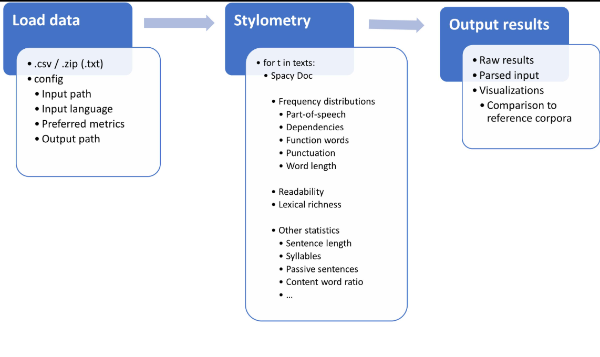
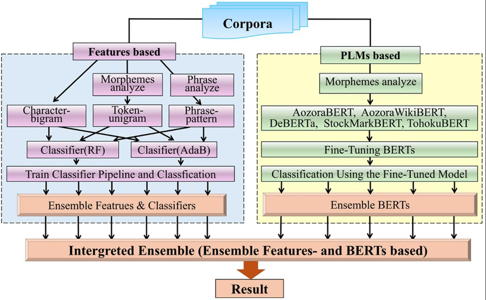
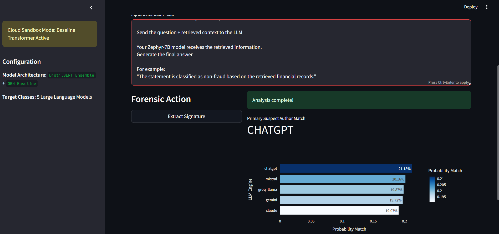
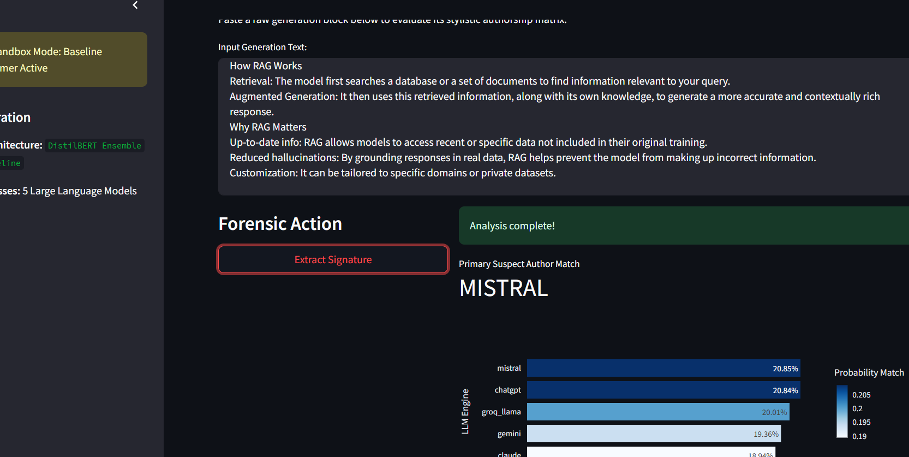
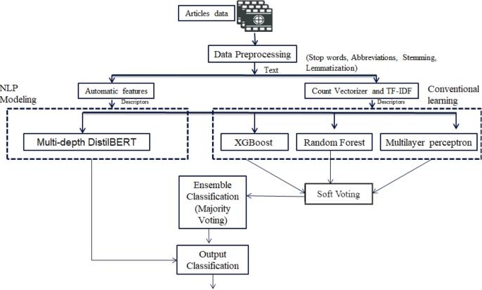
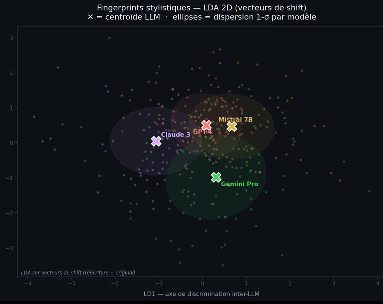
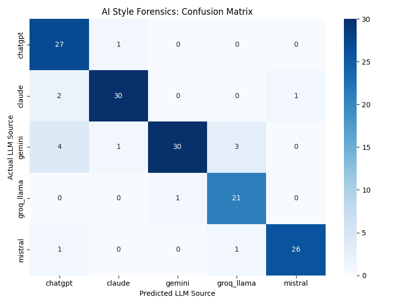
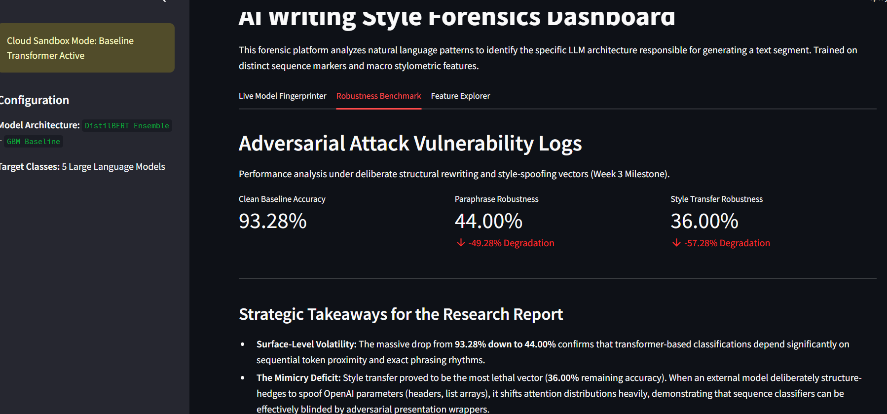

# 🔍 AuthentiText: Explainable LLM Fingerprinting & Forensic Stylometry
----- 

<p align="center"> 
   
  
  </br>
  
  
  <br>
   
  
  
</p>

-----

AuthentiText is an NLP forensics project that investigates whether AI-generated text contains distinctive linguistic and stylistic patterns that can help identify its originating Large Language Model (LLM).

The project combines a fine-tuned DistilBERT sequence classifier, traditional machine learning, stylometric feature engineering, and explainable AI to analyze outputs from five LLM families: ChatGPT, Claude, Gemini, LLaMA, and Mistral.

Beyond classification, AuthentiText explores the reliability of model attribution by examining formatting-related shortcuts, influential linguistic features, and the effects of adversarial transformations such as paraphrasing and style transfer.

-------
## 🚀 Key Features
1. **LLM Fingerprinting:** Classifies text across five target LLM families using transformer-based and traditional machine learning approaches.
2. **Formatting-Aware Preprocessing:** Reduces dependence on superficial formatting cues, including Markdown headings, tables, and structural patterns.
3. **Stylometric Feature Engineering:** Extracts lexical, syntactic, readability, and text-distribution features using spaCy, NLTK, and TF-IDF.
4. **Transformer Fine-Tuning:** Fine-tunes DistilBERT to learn linguistic representations useful for model attribution.
5. **Explainable AI:** Uses SHAP visualizations to investigate features influencing model predictions.
6. **Adversarial Evaluation:** Tests how paraphrasing and style-transfer transformations affect classification behavior.
7. **Interactive Dashboard:** Provides a Streamlit interface for text input, model inference, and attribution analysis.
----------
## 🛠️ Project Architecture

The repository is organized into data engineering, model training, feature extraction, evaluation, explainability, and deployment components.

```

AuthentiText/
├── analysis_plots/              # Evaluation and explainability visualizations
│   ├── confusion_matrix.png
│   ├── shap_adversarial_gpt4o_spoof.png
│   └── shap_original_claude.png
│
├── data_engineering/            # Dataset collection, validation, and preparation
│   ├── check_csv.py
│   ├── collect_data.py
│   ├── merge_data.py
│   ├── prep_colab_data.py
│   └── repair_csv_structure.py
│
├── distilbert_weights/          # Local model configuration and tokenizer assets
│
├── research_scratchpad/         # Experiments and diagnostic utilities
│
├── src/                         # Training, preprocessing, and evaluation
│   ├── adversarial_attacks.py
│   ├── compile_final_dataset.py
│   ├── evaluate_matrix.py
│   ├── extract_features.py
│   ├── feature_pipeline.py
│   ├── local_tune.py
│   └── test_utils.py
│
├── .gitignore
├── README.md
├── app.py                       # Interactive Streamlit dashboard
├── master_matrix.py             # TF-IDF and stylometric feature analysis
├── requirements.txt             # Project dependencies
└── train_baselines.py           # Traditional ML baseline training
```
-------------


### Confusion Matrix
<p align="center">
    
    
</p>


The confusion matrices provide a class-by-class view of correct predictions and misclassifications across the five target model categories.
----------

## 🧠 Methodology

1. Data Collection and Preparation

The data engineering pipeline supports collecting, validating, merging, and preparing text samples for supervised classification.

The preprocessing workflow is designed to maintain dataset consistency and reduce data-quality issues, including malformed CSV structures and inconsistent target-label mappings.

Key components include:

Dataset collection and merging.
CSV structure validation and repair.
Label consistency checks.
Preparation of training and evaluation datasets.
Investigation of dataset boundaries and potential leakage.
2. Formatting-Aware Text Preprocessing

A key challenge in LLM fingerprinting is that a classifier may learn superficial formatting differences instead of meaningful linguistic patterns.

For example, differences in Markdown headings, bullet points, tables, or response structure can become shortcuts for distinguishing classes.

AuthentiText investigates formatting-aware preprocessing to reduce these signals and encourage the model to focus on more informative lexical and syntactic characteristics.

3. Transformer-Based Classification

The primary deep learning component uses DistilBERT, fine-tuned for multiclass text classification.

The training workflow includes:

Loading pretrained transformer and tokenizer assets.
Fine-tuning the encoder for the target classification task.
Configuring optimization and training parameters.
Evaluating predictions across model classes.
Saving and loading model checkpoints for inference.

The documented fine-tuning configuration uses a learning rate of 
2
×
10
−
5
 over five epochs. Actual results depend on the dataset, split, checkpoint, and training configuration used.

4. Traditional Machine Learning and Stylometric Features

Alongside transformer-based classification, the project explores traditional machine learning baselines and engineered text features.

The feature pipeline combines TF-IDF representations with stylometric signals to investigate linguistic patterns that may distinguish outputs from different LLM families.

Feature categories include:

Lexical: Word distributions, vocabulary patterns, and token-level statistics.
Syntactic: Sentence structure and part-of-speech patterns.
Readability: Sentence length and text-complexity measures.
Text distribution: TF-IDF and related frequency-based representations.

The project also explores Gradient Boosting as a complementary classification approach. Its performance should be evaluated independently and compared against the DistilBERT baseline using the same evaluation protocol.

---------

## 📊 Performance and Evaluation

AuthentiText evaluates model attribution through validation metrics, confusion matrices, and class-level precision and F1-scores.

The project has reported the following results during experimentation:

Metric	Reported result
Validation accuracy	90.0% in one documented evaluation
Validation accuracy	93.28% in a separate reported result
Claude F1-score	Up to 0.92
Mistral F1-score	Up to 0.95
Gemini precision	Up to 0.97

Important: The two reported validation accuracy figures should not be treated as results from the same experiment unless verified. The final README should identify the selected model, dataset split, and evaluation run associated with the headline metric.

Class-level metrics can vary across checkpoints and dataset splits. Precision and F1-score should therefore be interpreted alongside class support, recall, and the confusion matrix.

Confusion Matrix

!Confusion Matrix

The confusion matrix provides a class-by-class view of correct predictions and misclassifications. It helps identify which model families the classifier distinguishes effectively and which produce more similar linguistic patterns.


---------- 

## 🔬 Explainability and Adversarial Evaluation
SHAP-Based Explainability

AuthentiText incorporates SHAP visualizations to investigate which text features contribute to model predictions.

The explainability workflow helps explore:

Features associated with particular model classes.
Linguistic patterns that influence classification decisions.
Potential dependence on superficial formatting artifacts.
Changes in feature importance under transformed inputs.

SHAP explanations describe model behavior; they do not independently establish that a feature is a reliable or unique fingerprint of a particular LLM.

Adversarial Robustness Testing

The project includes an adversarial testing component in src/adversarial_attacks.py.

It supports experiments investigating how attribution changes when text is modified through techniques such as:

Paraphrasing.
Stylistic rewriting.
Formatting changes.
Style-transfer transformations.

These experiments help identify vulnerabilities and measure prediction stability under modified inputs. Robustness claims should be based on measured results across clearly documented attack settings rather than the presence of an attack-testing module alone.

-----------

## 💻 Installation and Local Deployment
Prerequisites
Python 3.10 or a compatible version.
PyTorch.
Hugging Face Transformers.
Scikit-learn.
spaCy and NLTK.
Streamlit and visualization dependencies.
1. Clone the Repository
git clone <your-repository-url>
cd AuthentiText


Replace <your-repository-url> with your actual repository URL.

2. Install Dependencies

Using the project's dependency file:

pip install -r requirements.txt


Alternatively, install the main dependencies directly:

pip install torch transformers pandas scikit-learn
pip install matplotlib seaborn streamlit plotly shap spacy nltk

3. Launch the Streamlit Dashboard
python -m streamlit run app.py


The dashboard provides an interactive interface for submitting text and inspecting model attribution results.

4. Model Checkpoint Configuration

The application supports loading locally available fine-tuned model weights and tokenizer assets.

Before running inference, verify that:

The checkpoint corresponds to the intended model architecture.
Tokenizer and model configurations are compatible.
The label-to-index mapping matches the training configuration.
The application reports which inference path is active.

If fine-tuned weights are unavailable, a fallback mode may be used if implemented in the application. Results from a fallback model should be clearly distinguished from predictions produced by the fine-tuned checkpoint.

5. Streamlit Community Cloud

Large model checkpoints may be unsuitable for direct storage in Git. If the weights are excluded through .gitignore, configure a suitable checkpoint-loading strategy for deployment.

Ensure that missing weights are handled explicitly and that the application does not present fallback predictions as results from the fine-tuned model.

--------

## ⚠️ Limitations

LLM fingerprinting is a probabilistic attribution task, not definitive proof of authorship.

Potential limitations include:

Dataset bias: Imbalanced or narrow datasets may distort reported performance.
Distribution shift: Results may decline on prompts, topics, languages, or model versions absent from training data.
Formatting shortcuts: Models may exploit presentation patterns rather than stable linguistic signals.
Adversarial sensitivity: Paraphrasing and rewriting can change the features used for attribution.
Model overlap: Different LLMs may produce similar writing styles, making reliable attribution difficult.
Evaluation leakage: Duplicate prompts or related samples across training and validation splits can inflate metrics.

Reliable evaluation requires carefully separated datasets, consistent label mappings, and testing on unseen prompts. Results should be interpreted as evidence of classification performance under a particular evaluation setup rather than proof that an arbitrary text was generated by a specific model.

----------

## 🔮 Future Improvements

Potential next steps include:

Evaluating generalization across unseen prompts and model versions.
Comparing DistilBERT, Gradient Boosting, and TF-IDF baselines under a shared protocol.
Expanding adversarial testing to additional paraphrasing and style-transfer methods.
Improving calibration and uncertainty estimation for ambiguous predictions.
Investigating cross-domain and cross-model-family generalization.
Publishing reproducible evaluation configurations and dataset documentation.

-----------


## 🎯 Project Objective

AuthentiText explores how transformer representations and stylometric features can be combined to investigate LLM attribution, while using explainability and adversarial evaluation to better understand model behavior and its limitations.

The goal is not simply to classify generated text, but to examine which linguistic signals support attribution, whether those signals remain useful under text transformations, and how reliably they generalize beyond the evaluation dataset.

Disclaimer: AuthentiText is an experimental NLP forensics project. Its predictions should not be treated as conclusive evidence of text authorship or used as the sole basis for consequential decisions.
