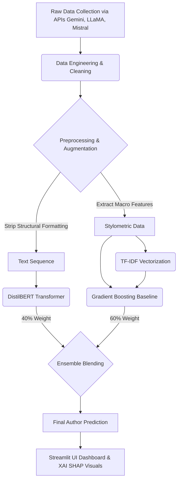

# AuthentiText (AI Model Fingerprinting) - Project Info

This document provides a high-level overview of the AI Model Fingerprinting project, mapping out its architecture, the target audience, BNY Mellon specific operational functionalities, and the roadmap for future development.

---

## 🏗️ 1. Complete System Flow Diagram

The architecture utilizes a hybrid ensemble to ensure robust stylometric classification against adversarial spoofing.

---

## 📂 2. Architecture & File Pathway Map

*   **Root Directory (Core Execution)**
    *   `app.py`: The interactive multi-tab Streamlit web dashboard.
    *   `master_matrix.py`: Orchestrator that merges dense stylometric embeddings with sparse TF-IDF features.
    *   `train_baselines.py`: Benchmark scripts for traditional ML estimators.
*   **`src/` (Core Production Pipeline)**
    *   `local_tune.py`: PyTorch Trainer constructor for fine-tuning DistilBERT on stylometric datasets.
    *   `adversarial_attacks.py`: Simulates prompt spoofing to evaluate boundary vulnerabilities.
    *   `feature_pipeline.py` & `extract_features.py`: Computes semantic density profiles and parses linguistic metrics.
    *   `test_utils.py`: Text sanitization utilities (stripping structural formatting masks).
*   **`data_engineering/`**
    *   Contains `collect_data.py`, `merge_data.py`, and `repair_csv_structure.py` for API crawling, data aggregation, and integrity validation frameworks.
*   **`analysis_plots/`**
    *   Holds evaluation metrics, confusion matrices, and SHAP (Explainable AI) visual attributions.

---

## 🎯 3. Target Audience & Use Cases

1.  **Forensic Stylometry:** Identifying invisible syntax signatures to determine if a document is human or AI-generated (and by which specific architecture).
2.  **Educational Integrity:** Assisting educators and publishers in maintaining academic and literary integrity.
3.  **Data Provenance:** Verifying dataset origins to ensure no "synthetic data contamination" occurs in production AI pipelines.

---

## 🏦 4. BNY Mellon Operational Functionalities

As a globally systemically important bank (GSIB), BNY Mellon can directly leverage this system for critical security and compliance operations:

*   **Fraud Detection in Financial Reporting:** Automatically scanning ingested disclosures, earnings reports, and financial statements to flag highly-confident AI-generated fabrications for human auditing.
*   **Defending Against AI-Powered Phishing:** Acting as an advanced email security layer. By detecting the linguistic footprint of an LLM, it can flag sophisticated, personalized social engineering and spear-phishing attacks before they reach executives.
*   **Internal Compliance & Code Authorship:** Scanning code commits or outbound client emails to verify that employees are not using unauthorized AI assistants for restricted, proprietary communications.
*   **Automated Trading Bot Detection:** Verifying whether tickets, communications, or market order requests originated from a human client or a disguised automated algorithmic script.

---

## 🚀 5. Future Scope & Roadmap

*   **Multimodal & Multilingual Fingerprinting:** Expanding classification to handle financial reports in multiple languages and detecting AI signatures in code snippets (Python/Java).
*   **Real-time Streaming API:** Converting the batch processing pipeline into a low-latency gRPC or REST API to evaluate text in milliseconds as it is typed.
*   **Continuous Learning (MLOps):** Implementing an automated feedback loop where the model retrains itself as new models (like GPT-5) are released into the wild.
*   **Advanced XAI Integration:** Expanding the interactive dashboard so users can click on specific sentences to see the exact neural attributions driving the model's suspicion.

---

## 🔍 Appendix: The Detective Story (Memory Mnemonic)

**"The Fingerprint in the Machine"**
Imagine you are building a high-tech forensic lab at BNY Mellon. You send out field agents (`data_engineering`) to gather evidence. Inside the lab, your master detective (`local_tune.py` DistilBERT model) examines it under a microscope, combined with your blending machine (`master_matrix`). 

Initially, your detective was lazy, stuck at 13% accuracy because they were just looking at superficial formatting disguises (markdown masks). You stepped in, stripped away the masks (`test_utils.py`), and gave the detective a gentle learning curve (unfreezing layers with a low learning rate). The detective became a genius, hitting 90% accuracy, and is now ready to stop AI phishing, catch fake financial reports, and identify rogue trading bots across the bank!
